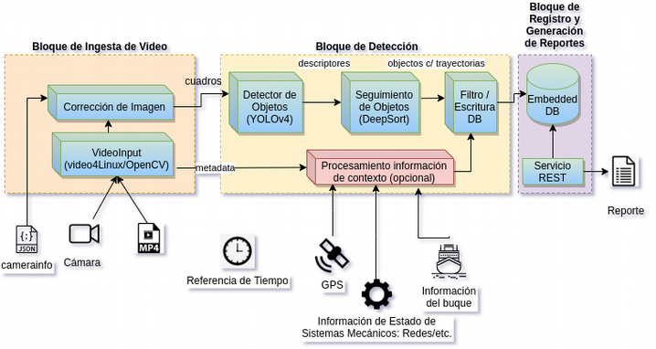

# IA para pesca

Este proyecto consiste en la utilización de IA para monitoreo de actividades a bordo de buques pesqueros. Se integran componentes que se mantienen en repositorios separados, para formar una cadena completa de procesamiento.



Este documento describe la organización de directorios para el desarrollo y ensayo de componentes utilizados. El objetivo es poder replicar un ambiente de trabajo en distintas PCs reduciendo al mínimo posible los pasos de configuración. El flujo de trabajo propuesto es para prototipado.

## Contenido

[TOC]

## Introducción

- Todos los componentes esperan una entrada y generan una salida. La entrada puede ser la salida de un componente anterior.

## Organización del proyecto

Componentes:

| Componente              | Entrada                                            | Salida                                                       | Descripción                                      |
| ----------------------- | -------------------------------------------------- | ------------------------------------------------------------ | ------------------------------------------------ |
| data-preparation        | directorio con dataset                             | directorio o .tar.gz con dataset organizado según lo requerido por el detector y por el object-tracker. | Scripts de preparación de datos.                 |
| object-detector-trainer | dataset preprocesado                               | Pesos de YOLOv4 en formato Darknet. Opcional: conversión a otros formatos. | Entrenador del modelo de detección.              |
| object-detector         |                                                    |                                                              | Componente para realizar detecciones con YOLOv4. |
| object-tracker          | ???                                                |                                                              |                                                  |
| object-tracker-trainer  | ???                                                |                                                              |                                                  |
| processing-pipelines    | - Imágenes/videos a procesar.<br/>- Configuración. | Reporte de detecciones.                                      |                                                  |

Para cada componente se mantiene un repositorio en github separado.

Este documento describe como clonar estos repositorios en un mismo espacio de trabajo y organizar los archivos de datos y configuración.

Se prone la siguiente organización de directorios. 

```
$WORKSPACE_PATH
	|-data
	|-data-preparation
	|-object-detector-trainer
	|-object-tracker
	|-object-tracker-trainer
	|-reports
	|-processing-pipelines	
	|-tmp
	README.md
```

Convenciones:

- La ruta absoluta del directorio de espacio de trabajo será referida como $WORKSPACE_PATH.
- Cada componente obtendrá sus entradas y generará sus salidas en el subdirectorio **data**. Nota: con excepción de archivos de configuración u otros de tamaño reducido, el contenido de de este directorio no se mantiene en .git. 
- Por ejemplo:
  - Para preparación de datos se leen los datos originales de **data** y se crea un nuevo directorio con los datos transformados.
  - Para inferencia se leen de **data** los archivos de imagen o video a procesar, pesos del modelo y configuraciones, y se generan en un nuevo directorio las salidas.
- Se adopta la convención para desarrollo con docker de montar el directorio **data** para lectura y escritura. 

## Guía rápida

### Clonar repositorio.

```bash
export WORKSPACE_PATH=~/workspace/ai-for-fisheries
mkdir $WORKSPACE_PATH
git clone --recursive https://github.com/nhorro/ai-for-fisheries.git $WORKSPACE_PATH
cd $WORKSPACE_PATH
```

### Iniciar Jupyter.

```bash
cd $WORKSPACE_PATH
docker run --rm -p 8888:8888 -p 6006:6006 -e GRANT_SUDO=yes -e JUPYTER_ENABLE_LAB=yes -v "$PWD":/notebooks amaksimov/python_data_science jupyter notebook --NotebookApp.token='' --NotebookApp.password=''
```

Nota: este docker contiene Tensorboard en el puerto 6006. Considerar usar otro puerto si se usa en conjunto con dockers para entrenamiento.

### Realizar inferencias

Iniciar docker en modo interactivo.

```bash
cd object-detector
docker run --rm -it -v $WORKSPACE_PATH/data:/data \                    
                    --workdir /work \
                    nhorro/opencv4-python3-yolo4:cpu \
                    /bin/bash
```

Procesar imagen.

```bash
python3 detect.py --input /data/test/fisheries-test.jpeg \
                  --model-weights="/data/models/fisheries/yolov4.weights" \
                  --model-cfg="/data/models/fisheries/yolov4.cfg" \
                  --classes-txt="/data/models/fisheries/classes.txt"
```

Procesar video.

```bash
python3 detect.py --input /data/test/fisheries-test.mp4 \
                  --model-weights="/data/models/coco/yolov4.weights" \
                  --model-cfg="/data/models/coco/yolov4.cfg" \
                  --classes-txt="/data/models/classes.txt"
```

Procesar lote.

```bash
python3 detect.py --input /data/test/fisheries-test.txt \
                  --model-weights="/data/models/coco/yolov4.weights" \
                  --model-cfg="/data/models/coco/yolov4.cfg" \
                  --classes-txt="/data/models/classes.txt"
```

### Generar o visualizar un reporte en Jupyter

```bash
#FIXME
```

## Descripción de componentes

### data

Directorio para datasets, pesos, archivos grandes. 

### Setup inicial

Crear estructura de directorios.

```bash
cd $WORKSPACE_PATH
mkdir data
mkdir data/datasets
mkdir data/inputs
mkdir data/models
mkdir data/media
mkdir data/outputs
```

### data-preparation

Cuadernos Jupyter Notebook/Python de preparación de datos.

- **kaggle-fisheries**: preparación de datos para dataset de Kaggle (básica).
- **fishnet**: preparación de datos para dataset de [fishnet.ai](https://www.fishnet.ai/).

##### Entradas

- Se descargan los datasets de las fuentes originales mediante scripts .sh, python u otros.
- Para las fuentes no públicas se mantienen las claves de acceso en secrets.txt (no se sube a git).

### object-detector-trainer

Ambiente para entrenamiento de YOLOv4 basado en docker de [BMW Innovation Lab](https://github.com/BMW-InnovationLab/BMW-YOLOv4-Training-Automation).

##### Entradas

- Dataset y archivos de configuración para YOLOv4 preprocesados (ver data-preparation).
- Pesos iniciales de YOLOv4 (se usan los oficiales por defecto)

##### Salidas

- Pesos de modelo entrenado.

##### Setup inicial

```bash
cd object-detector-trainer
git clone --depth=1 https://github.com/BMW-InnovationLab/BMW-YOLOv4-Training-Automation.git
cd BMW-YOLOv4-Training-Automation
sudo docker build -f docker/Dockerfile -t darknet_yolov4_gpu:1 --build-arg GPU=1 --build-arg CUDNN=1 --build-arg CUDNN_HALF=0 --build-arg OPENCV=1 --build-arg DOWNLOAD_ALL=1 .
```

##### Observaciones

- Luego de muchas horas corta con mAP 0.1% sin informar error.

### object-detector

Contiene:

- Ambientes para inferencia con YOLOv4 para procesamiento con CPU y GPU. Publicados en [dockerhub](https://hub.docker.com/repository/docker/nhorro/opencv4-python3-yolo4).
- Implementación en python para evaluar desempeño del modelo (no usar para inferencia online). 

Ver [README en directorio del componente](object-detector/README.md]) para información detallada e instrucciones de uso.

##### Entradas

- Modelo entrenado YOLOv4.
- Archivos a procesar: video, imagen, o lote.

##### Salidas

- Video o imagen con detecciones.
- Archivo de texto con detecciones para cada dato de entrada. Ver **reports** para generar reportes con el desempeño de modelos.

### object-tracker

TODO.

### object-tracker-trainer

TODO.

### reports

Reportes en formato de cuadernos Jupyter Notebook con análisis y resultados de ensayos de los componentes y marco teórico. Algunos de los más importantes:

- [Reporte de evaluación de modelos de detector](reports/object-detector-models-report.ipynb): contiene resultados de ensayos con modelos de detectores.

### processing-pipelines

Cadenas de procesamiento de partes de componentes o end-to-end para mostrar prototipo a cliente.

```bash
#WIP
```

## Notas de desarrollo