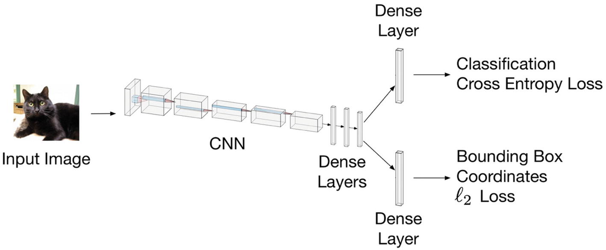

# Apuntes de Advanced Applied Deep Learning - Convolutional Neural Networks and Object Detection

## 1. Introduction and D.E. Setup

## 2. Tensorflow: Advanced Topics

## 3. Fundamentals of Convolutional Neural Networks

## 4. Advanced CNNs and Transfer Learning

## 5. Cost Functions and Style Transfer

## 6. Object Classification: An Introduction

Referencia a temas anteriores:

- Multiple loss functions
- Multi-task learning

### 6.1 What is object classification?

- Classification
- Classfication and localization
- Object detection
- Instance segmentation
- Semantic segmentation

### 6.2 Intersect Over Union (IoU)

### 6.3 A Naïve Approach to Solving Object Localization (Sliding Window Approach)

Ejemplo con MNIST.

Limitaciones de SW.

### 6.4 Classification and Localization

- **Key concept**: Multi Task Learning
- Learn at the same time:
  - Class
  - Position

Función de costo:
$$
J = J_{classification} + \alpha J_{BB}
$$
donde $\alpha$ es un hiperparámetro que debe ser ajustado.
$$
\ell_2 = \sum_{i=1}^m {( y^{(i)}_{true} - y^{(i)}_{pred} )}^2
$$

### 6.5 Region-Based CNN (R-CNN)

R-CNN, Fast R-CNN y Faster R-CNN

## 7. Object Localization: An implementation in Python

### 7.1 The You Only Look Once (YOLO) Method

- [Original YOLO Paper](https://arxiv.org/abs/1506.02640)

#### 7.1.1 Dividing the Image Into Cells

#### 7.1.2 YOLO v2 and Anchor Boxes

The original YOLO version had some shortcomings. For example, it was not very good at detecting objects that were too close. In the second version,[3](#Fn3) the authors introduced some optimizations, the most important one being *anchor boxes*. The network gives pre-determined sets of boxes, and instead of predicting bounding boxes completely from scratch, it simply predicted deviations from the set of anchor boxes. **The anchor boxes can be chosen depending on the type of objects that you want to predict, making the network better at certain specific tasks (for example, small or big objects).**

- 30 layers por el problema de downsampling para objetos pequeños

#### 7.1.3 YOLO v3

- Predicting boxes at different scales
- 53 layers
- Skip connections (concepto de ResNet para reducir, pero en este caso es para reducir el efecto del downsampling )
- 9 anchor boxes, tres para cada escala.
- Se predicen más anchor boxes para cada celda

#### 7.1.4 Non-Maxima Suppression

Si un único objeto ocupa más de una celda, es posible que se tengan múltiples BBs para el mismo objeto, por lo tanto, se debe elegir la que mejor aplique. Se sigue este procedimiento:

1. Se descartan todas las celdas en las que la probabilidad de presencia de un objeto sea menor que un umbral (típicamente 0.6)
2. Se consideran todas las celdas con la proabilidad más alta de incluir un objeto.
3. Se toman los BBs que tienen mayor puntaje y se remueven los que tienen IOU mayor que un umbral determinado entre sí (tipicamente 0.5). Eso elimina las BB similares.

### 7.1.5 Loss function

La función de costo se compone de tres partes:

- Costo de clasificación
- Costo de localización (el error entre la BB de la predicción y la real)
- Confidence loss  (si hay un objeto presente o no)

##### 7.1.5.1 Classification loss

$$
\sum_{i=0}^{S^2} I^{obj}_i \sum_{c \in classes} {(p_i(c)-\hat{p_i}(c))}^2
$$

donde:

- $I^{obj}_i$ indica si existe un objeto en la celda i. 1= Sí, 0=No.
- $\hat{p_i}(c)$ probabilidad de pertenencia a la clase $c$ de la celda $i$.

##### 7.1.5.2 Localization loss

$$
\lambda_{coord} \sum_{i=0}^{S^2} \sum_{j=0}^{B} I^{obj}_i [
	(x_i-\hat{x}_i)^2 + (y_i-\hat{y}_i)^2 ] + \lambda_{coord}  \sum_{i=0}^{S^2} \sum_{j=0}^{B} I^{obj}_i [
	(\sqrt{w_i}-\sqrt{\hat{w}_i})^2 + (\sqrt{h_i}-\sqrt{\hat{h}_i})^2
]
$$

##### 7.1.5.3 Confidence loss

